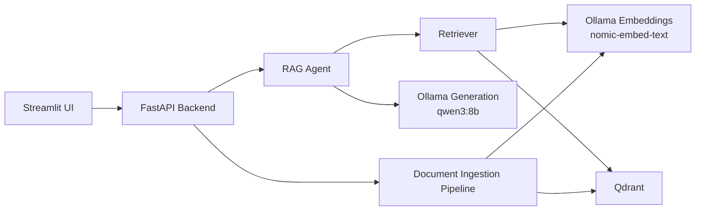

# local-production-rag-agent

A portfolio-grade local Retrieval-Augmented Generation project that demonstrates a production-style RAG agent running fully on a developer laptop. It combines a FastAPI backend, Streamlit frontend, Ollama-hosted local models, and Qdrant vector search to deliver grounded answers with citations, refusals, document ingestion, and evaluation.

## What This Project Demonstrates
- Production-style RAG pipeline with ingestion, chunking, embeddings, retrieval, generation, verification, and evaluation.
- Local LLM usage through Ollama with `qwen3:8b` for generation and `nomic-embed-text` for embeddings.
- Structured FastAPI backend design with typed Pydantic schemas, logging, error handling, and local CORS support.
- Streamlit user experience for upload, chat, summarization, comparison, and evaluation workflows.
- Dockerized local deployment for backend, frontend, and Qdrant.
- A realistic sample enterprise knowledge base plus an evaluation dataset.

## Architecture


## Repository Structure
```text
local-production-rag-agent/
  backend/
  frontend/
  data/
  scripts/
  docker-compose.yml
  Makefile
  .env.example
  README.md
  AGENTS.md
```

## Tech Stack
- Python 3.11+
- FastAPI
- Streamlit
- Ollama
- Qdrant
- Docker Compose
- pytest
- Pydantic

## Features

### Document Ingestion
- Upload `PDF`, `DOCX`, `TXT`, and `Markdown`.
- Preserve PDF page numbers when extractable.
- Split content into overlapping chunks.
- Store `document_id`, `filename`, `page_number`, `chunk_id`, `text`, and `created_at`.
- Generate embeddings through local Ollama.
- Index into Qdrant.
- List and delete indexed documents.

### RAG Chat
- Classifies whether retrieval is needed.
- Rewrites the query for retrieval.
- Retrieves top-k chunks from Qdrant.
- Builds a grounded prompt using only retrieved context.
- Generates an answer with citations.
- Refuses with `I don't know based on the provided documents.` when support is insufficient.
- Returns answer, citations, retrieved chunks, confidence, and refusal state.

### Agent Tools
- `retrieve_context(query)`
- `answer_with_context(question, context)`
- `summarize_document(document_id)`
- `compare_documents(document_id_a, document_id_b)`
- `evaluate_answer_grounding(answer, retrieved_chunks)`

### Evaluation
- Includes 20 evaluation questions across answerable and unanswerable cases.
- Reports retrieval hit rate, citation presence rate, refusal accuracy, and groundedness rate.

## Latest Results

### Fast Evaluation Snapshot
Run date: `2026-05-17`

Command:

```bash
make eval-fast
```

Observed metrics on the local demo setup:

```json
{
  "total_questions": 8,
  "retrieval_hit_rate": 1.0,
  "citation_presence_rate": 1.0,
  "refusal_accuracy": 1.0,
  "groundedness_rate": 1.0
}
```

What this means:
- Retrieval consistently found the expected source document in the fast eval set.
- Every returned answer included citations.
- The agent correctly answered or refused for all fast-eval questions in that run.
- The groundedness heuristic marked all fast-eval outputs as supported.

Note: `make eval-fast` is the recommended interview/demo benchmark because it reflects the real pipeline while keeping latency practical on local hardware.

## API Endpoints
- `GET /health`
- `POST /documents/upload`
- `GET /documents`
- `DELETE /documents/{document_id}`
- `POST /chat`
- `POST /documents/{document_id}/summarize`
- `POST /documents/compare`
- `POST /evaluate`

## Local Setup

### 1. Install Ollama
Install [Ollama](https://ollama.com/) on your machine, then pull the models:

```bash
ollama pull qwen3:8b
ollama pull nomic-embed-text
```

### 2. Project Setup
```bash
cd local-production-rag-agent
make setup
```

The `Makefile` uses `py -3.12` on Windows to avoid Python 3.14 compatibility issues with `pydantic-core`. If you prefer Python 3.11, update the interpreter line in `Makefile`.

### 3. Start the Stack
```bash
make up
```

### 4. Open the UI
- Streamlit UI: [http://localhost:8501](http://localhost:8501)
- FastAPI docs: [http://localhost:8000/docs](http://localhost:8000/docs)
- Qdrant: [http://localhost:6333/dashboard](http://localhost:6333/dashboard)

### 5. Ingest Sample Documents
```bash
make ingest-samples
```

### 6. Run Evaluation
```bash
make eval
```

For a faster interview-friendly run:

```bash
make eval-fast
```

`make eval-fast` evaluates a smaller subset with shorter generations, which is a better fit for local laptop demos.

### 7. Run Tests
```bash
make test
```

## Docker Notes
- The backend connects to Ollama at `http://host.docker.internal:11434`.
- On Linux, ensure `host.docker.internal` resolves correctly or update `OLLAMA_BASE_URL` in `.env`.

## Example API Usage

### Upload Documents
```bash
curl -X POST "http://localhost:8000/documents/upload" ^
  -F "files=@data/sample_docs/hr_policy.md" ^
  -F "files=@data/sample_docs/security_policy.md"
```

### Ask a Question
```bash
curl -X POST "http://localhost:8000/chat" ^
  -H "Content-Type: application/json" ^
  -d "{\"question\":\"What does the security policy require for MFA?\",\"top_k\":5}"
```

### Run Evaluation
```bash
curl -X POST "http://localhost:8000/evaluate" ^
  -H "Content-Type: application/json" ^
  -d "{\"top_k\":5}"
```

## Troubleshooting
- If `/health` shows Ollama as unavailable, start the Ollama desktop app or run `ollama serve`.
- If embeddings fail, verify `ollama pull nomic-embed-text` completed successfully.
- If answers are empty or refusals happen too often, ingest documents again and inspect retrieved chunks in the Streamlit UI.
- If Qdrant is unavailable, rerun `docker compose up --build` and confirm port `6333` is free.
- If Docker on Linux cannot reach Ollama, replace `host.docker.internal` with your host IP in `.env`.


## Production Improvements
- Add authentication and RBAC.
- Persist original files and processing metadata in object storage or Postgres.
- Add background workers for ingestion and evaluation.
- Add hybrid search and reranking.
- Add tracing, metrics, dashboards, and prompt/version management.
- Add stronger citation-level faithfulness evaluation.

## Limitations
- The verifier uses lightweight heuristics rather than a full fact-checking model.
- Listing documents is derived from indexed chunks rather than a separate metadata database.
- PDF extraction quality depends on document formatting and OCR is not included.
- Local LLM latency and quality depend on the host machine.
- Full evaluation can be slow on local hardware because it performs real sequential generation across many questions.
